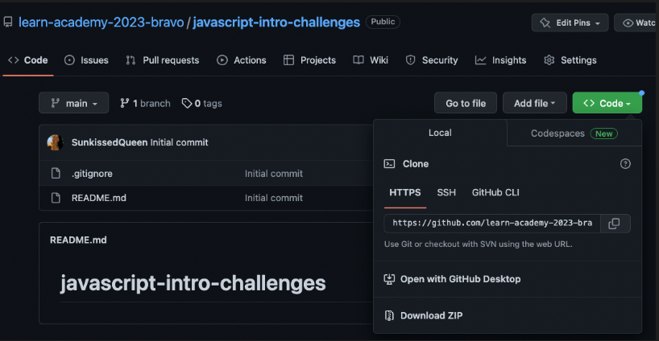
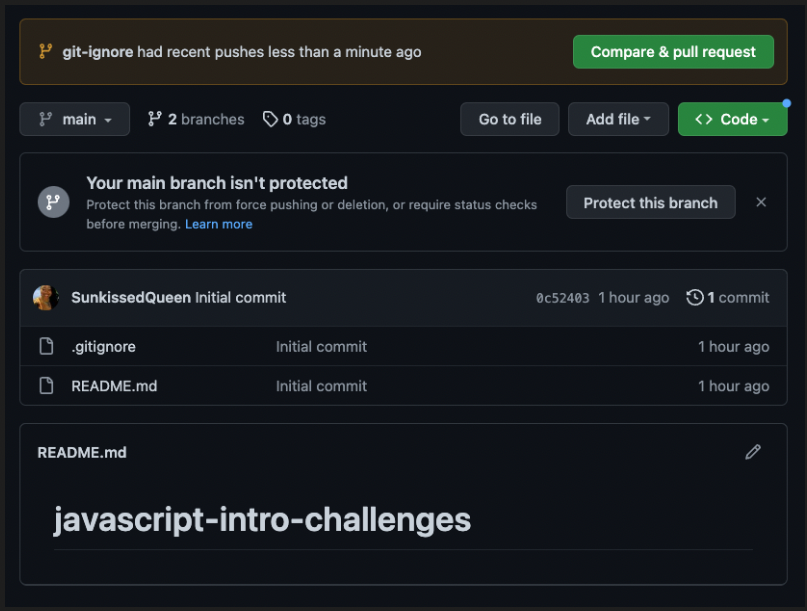
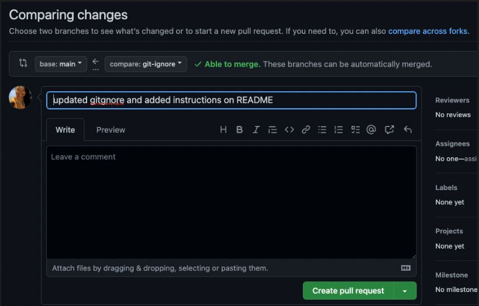
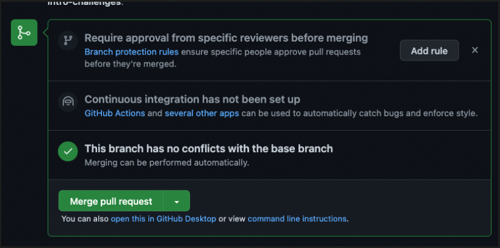
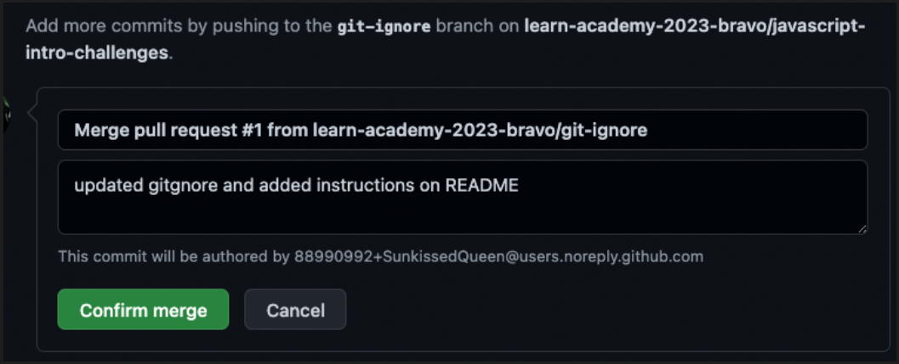

# Javascript Foundations Challenges
This repository holds the vanilla JavaScript foundations pair programming challenges for the 2023 Bravo cohort.

## Syllabus References  

- [Collaborative Coding](https://github.com/learn-academy-2023-bravo/Syllabus/blob/main/github/pairing-with-github.md)  

- Pushing Changes From Local Repo to Remote Repo *Starting at Step 7* of [GitHub](https://github.com/learn-academy-2023-bravo/Syllabus/blob/main/github/github.md)  

## Process Notes

- Anything wrapped in `< >` is an indication that this will be named uniquely, the `< >` are NOT included in the command
- `$` is an indication of a command line prompt, the `$` is not included
- Anything in `( )` is informational and not included in the command
- The term local/locally means your personal computer.
- The term remote means GitHub.


### Naming Conventions

Branches and file names should be in ***all lowercase letters with no spaces*** :

- Branch name: `topic-initials1-initials2`   
(ex. func-loops-arrays-cb-nr)
- File name: `topic-name1-name2.md`  
(ex. func-loops-arrays-charlean-nicole.md)


### Informational Commands

Use this informational command to tell you what files have been modified and what phase of the git process you are on:

- $ `git status`

Use this informational command to the branches you have locally on a repo:

- $ `git branch`  

The branch that you are on currently will be denoted with an asterisk.
```bash
* javascript-foundations-ts-cb
  main
```
Use this command to see your location within a folder or file, present working directory  
- $ `pwd` 


### Cloning the Repo

Use this command if you don't have the repository (folder) on your local machine:

- $ `git clone <repo-url>` (the url is the https address copied and pasted from the code dropdown button on GitHub)




### Create a Branch

Use this command if you need to create a branch that does not exist on either repos locally or remotely:

- $ `git checkout -b <topic-initials1-initials2>`  
(ex. git checkout -b javascript-foundations-ts-cb)


### Changing to a Local Branch

Use this command to move to a branch that exists on your local machine:

- $ `git checkout <branch-name>`  
(ex. git checkout javascript-foundations-ts-cb)

Best practice is to ensure you update the branch to include any changes made to the branch
- $ `git pull origin <branch-name>`  
(ex. git pull origin javascript-foundationa-ts-cb)


### Changing to a Remote Branch

Use these commands if the repo you are working on has a branch remotely that is ***NOT on your local machine***:

- $ `git fetch origin <branch-name>`
- $ `git checkout <branch-name>`

Use this command if the repo you are working on has a branch remotely that ***is on your local machine but you DON'T have the latest version of the code from GitHub***:
- $ `git pull origin <branch-name>`


### Pushing Local Code to GitHub

Use these commands to add the code you have on your local machine to GitHub:

- $ `git status` 
- $ `git add <file-name>`
- $ `git commit -m "message describing the work that was accomplished"`
- $ `git push origin <branch-name>`


### Merging Code to Main Branch Remotely
When you have completed work or you have been informed to start the next challenge, push local code to GitHub then follow the prompts on GitHub to create a pull request (PR)

> Click the compare & pull request button

> Click the create pull request button

> Click the merge pull request button

> Click the confirm merge button

> Click the delete branch button to remove the stale branch


### Deleting a Branch Locally

Branches exist on your local machine and on the remote. Always delete your stale branch in both places.  

You cannot delete a branch if you are on.

Delete the local stale branch after ensuring that your local main branch matches the changes you have added to your remote main branch.

- $ `git checkout main`
- $ `git pull origin main`
- $ `git branch -d <branch-name>`
